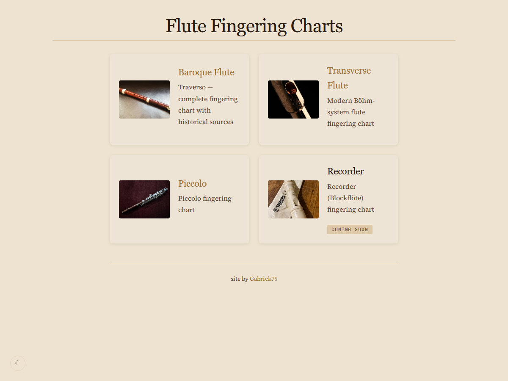
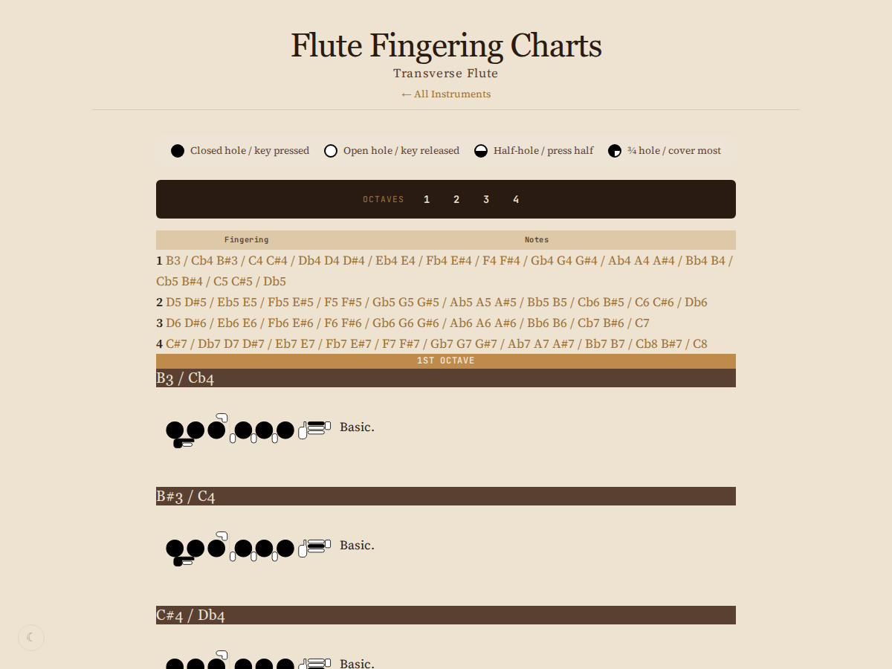
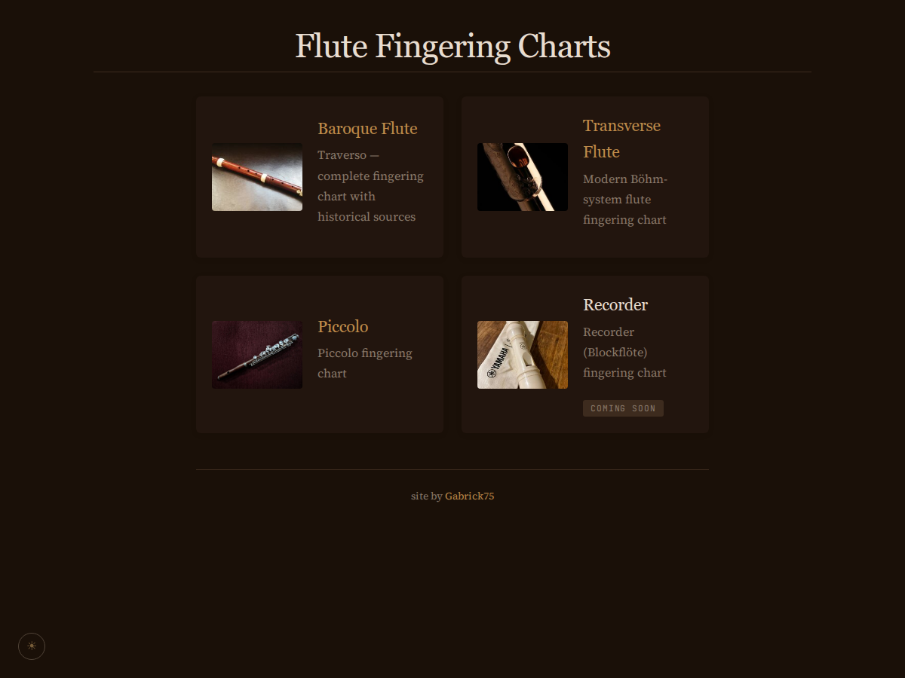

<div align="center">

# Flute Fingering Charts

**Multi-instrument fingering charts for historical and modern flutes** — built for
quick consultation on any device, from a phone during practice to a text-only browser.

[](https://react.dev)
[](https://www.typescriptlang.org)
[](https://vitejs.dev)
[](https://reactrouter.com)

</div>

---

## Screenshots

| Home | Transverse Flute (SVG diagrams) | Dark mode |
|:---:|:---:|:---:|
|  |  |  |

More screenshots: [baroque-flute](docs/screenshots/baroque-flute.png), [piccolo](docs/screenshots/piccolo.png).

## About

A central hub for flute fingering charts. Originally a static HTML page (designed
for the small screens of early smartphones), the project was migrated to a modern
Vite + React + TypeScript stack without losing its "works anywhere" spirit.

Every chart is **data-driven**: fingerings are rendered from structured data,
so what you see is what the data contains.

## Features

- 🎼 **Four instruments** — Baroque Flute (Traverso), Transverse Flute, Piccolo,
  plus a Recorder placeholder
- 🖼️ **Two chart views** — classic key-pill table *and* a self-contained SVG
  **fingering diagram** per variation
- 🔎 **Sticky octave navigation** — only ever offers octaves that exist on the page
- 🌙 **Dark mode** — persisted in `localStorage`, toggled without re-rendering charts
- 📱 **Mobile-first** — designed for consultation during practice, works on small screens
- 🧾 **Historical sources** — the baroque chart cites the historical source per fingering

## Instruments

| Instrument | Octaves | Notes | Variations | Status |
|---|---|---|---|---|
| Baroque Flute (Traverso) | 4 | 70 | 256 | ✅ Complete |
| Transverse Flute | 4 | 50 | 239 | ✅ Complete |
| Piccolo | 3 | 39 | 94 | ✅ Complete |
| Recorder | — | — | — | 🚧 Coming soon |

## Getting Started

```bash
npm install
npm run dev        # start the dev server → http://localhost:5173
npm run build      # type-check + production build to dist/
npm run preview    # serve the production build
```

### Verification

The app has no automated test suite — it is verified via `npm run build`
(type-check + production build).

## Documentation

| Doc | Covers |
|---|---|
| [Architecture](docs/ARCHITECTURE.md) | Routing, components, rendering modes, styling tokens |
| [Data Format](docs/DATA_FORMAT.md) | Data model, hole encoding, per-instrument differences |
| [Development](docs/DEVELOPMENT.md) | Setup, testing, adding an instrument, troubleshooting |
| [Contributing](docs/CONTRIBUTING.md) | Ground rules, PRs, and issue reporting |

## Tech Stack

- [React](https://react.dev) 18 — function components + hooks
- [TypeScript](https://www.typescriptlang.org) 5 — strict typing
- [Vite](https://vitejs.dev) 5 — build tool
- [React Router](https://reactrouter.com) v6 — client-side routing

## Project Structure

```
├── src/
│   ├── pages/          Home + one page per instrument
│   ├── components/     Layout, OctaveNav, FluteChartTable, FluteDiagram, …
│   ├── data/           Typed fingering datasets
│   └── styles/         main.css (design tokens) + home.css
└── docs/               Documentation + screenshots
```

## Credits

Site by [Gabrick75](https://github.com/Gabrick75).

## License

This project is currently unreleased and has no license specified — please contact
the maintainer before using or distributing it.
